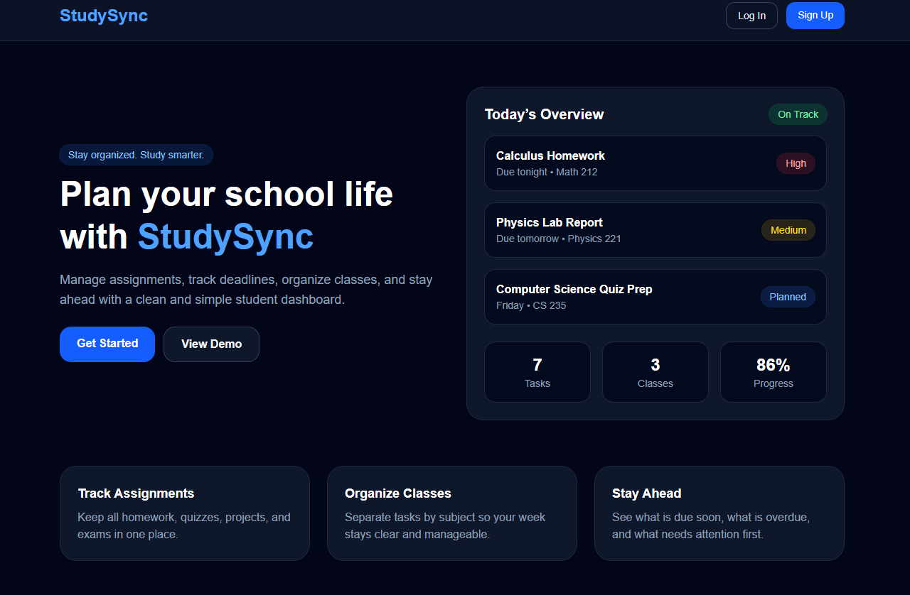

# StudySync

A modern student productivity dashboard built to help you stay organized, manage assignments, and track completion with proof.

---

## 🚀 Live Demo

👉 [https://your-vercel-link.vercel.app](https://studysync-pearl.vercel.app/)

---

## 📸 Preview



---

## ✨ Features

* 📝 Create, edit, and delete tasks
* 🎯 Priority system (High / Medium / Low)
* 📅 Due date tracking
* ✅ Mark tasks as complete (with required proof or notes)
* 🔄 Undo completed tasks
* 🌙 Fully responsive dark mode UI
* 🔐 Firebase authentication (login/signup)
* ☁️ Real-time database with Firestore

---

## 🧠 Why I Built This

As a student balancing multiple classes, assignments, and deadlines, I wanted a clean and efficient way to organize everything in one place.

StudySync was built to:

* Reduce clutter
* Improve productivity
* Enforce accountability through proof-based completion

---

## 🛠 Tech Stack

* **Frontend:** React (Vite)
* **Styling:** Tailwind CSS
* **Backend:** Firebase
* **Database:** Firestore
* **Auth:** Firebase Authentication

---

## 📂 Project Structure

```
studysync/
│── src/
│   ├── App.jsx
│   ├── firebase/
│   │   └── config.js
│   ├── components/
│   └── pages/
│
│── public/
│── screenshots/
│── package.json
```

---

## ⚙️ Installation

Clone the repo:

```bash
git clone https://github.com/YOUR_USERNAME/studysync.git
cd studysync
```

Install dependencies:

```bash
npm install
```

Run locally:

```bash
npm run dev
```

---

## 🔑 Environment Setup

Create a `.env` file and add your Firebase config:

```env
VITE_FIREBASE_API_KEY=your_key
VITE_FIREBASE_AUTH_DOMAIN=your_domain
VITE_FIREBASE_PROJECT_ID=your_project_id
VITE_FIREBASE_STORAGE_BUCKET=your_bucket
VITE_FIREBASE_MESSAGING_SENDER_ID=your_id
VITE_FIREBASE_APP_ID=your_app_id
```

---

## 📌 Future Improvements

* 📊 Task analytics & productivity stats
* 🔔 Notifications & reminders
* 📱 Mobile optimization improvements
* 📎 Optional file/image proof uploads
* 🧑‍🤝‍🧑 Shared tasks / collaboration

---

## 📄 License

This project is open source and available under the MIT License.

---

## 👤 Author

**Omar Khalaf**
Computer Science Student

---
